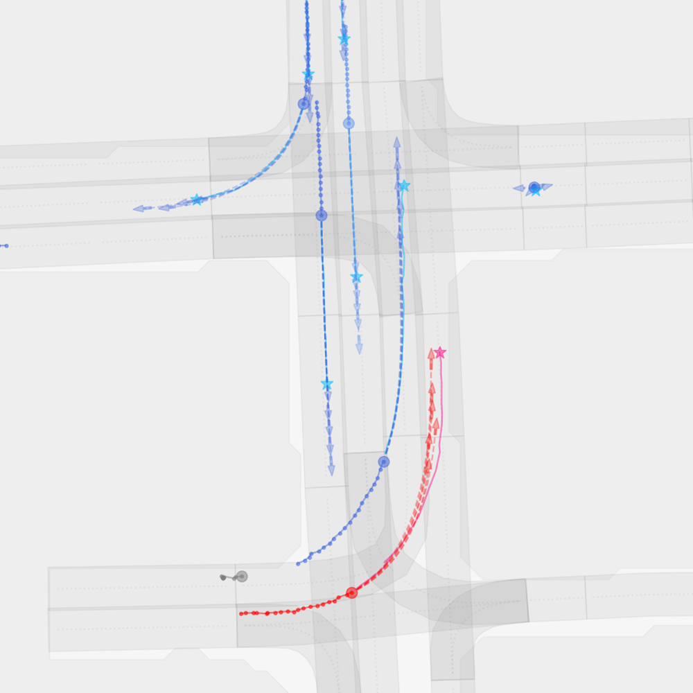
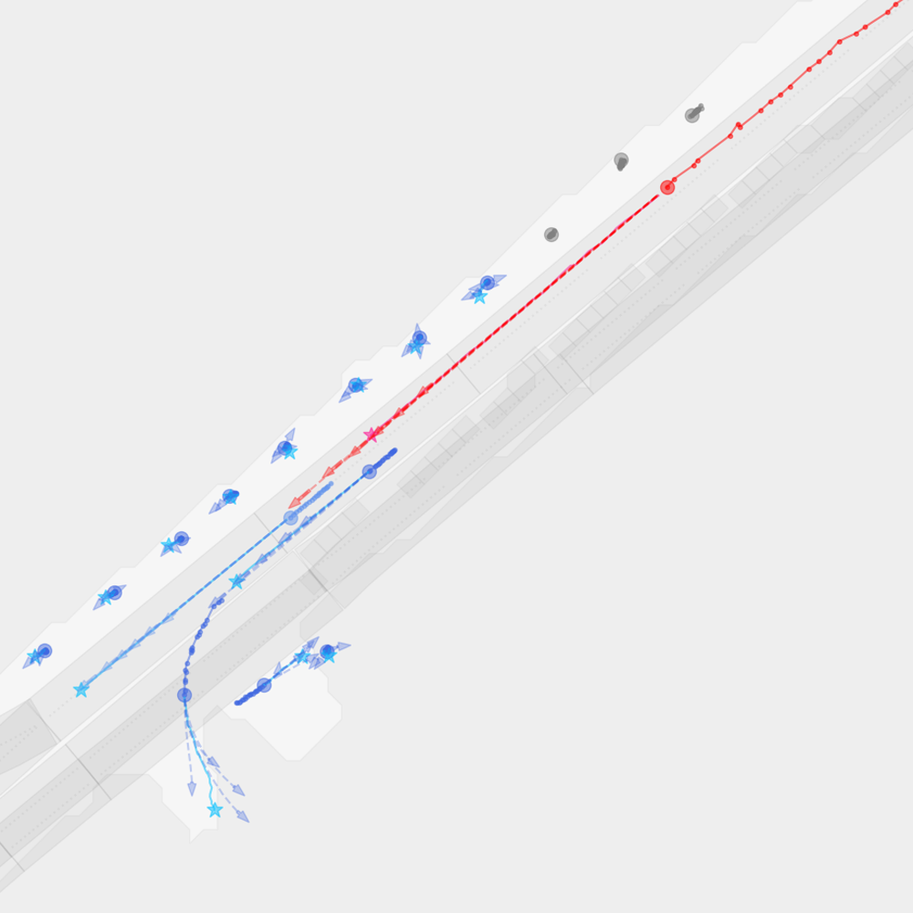
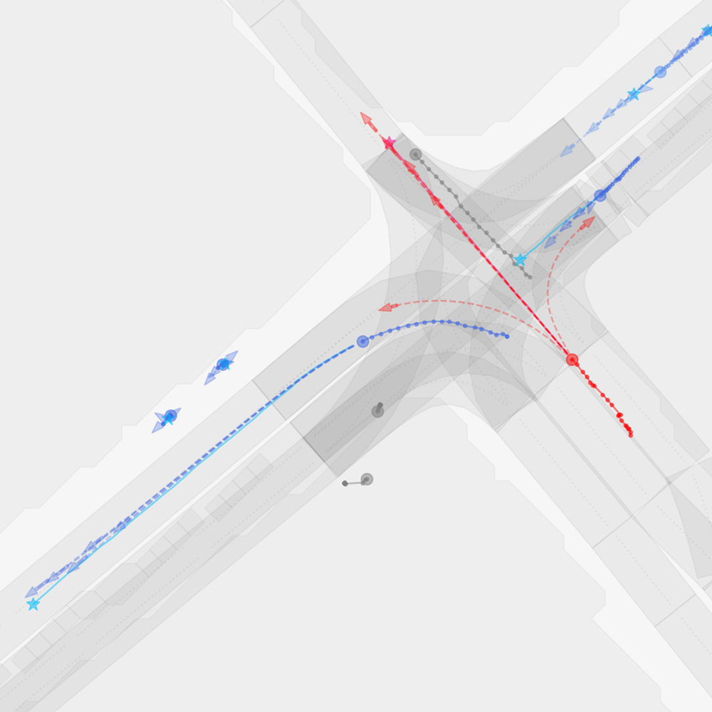
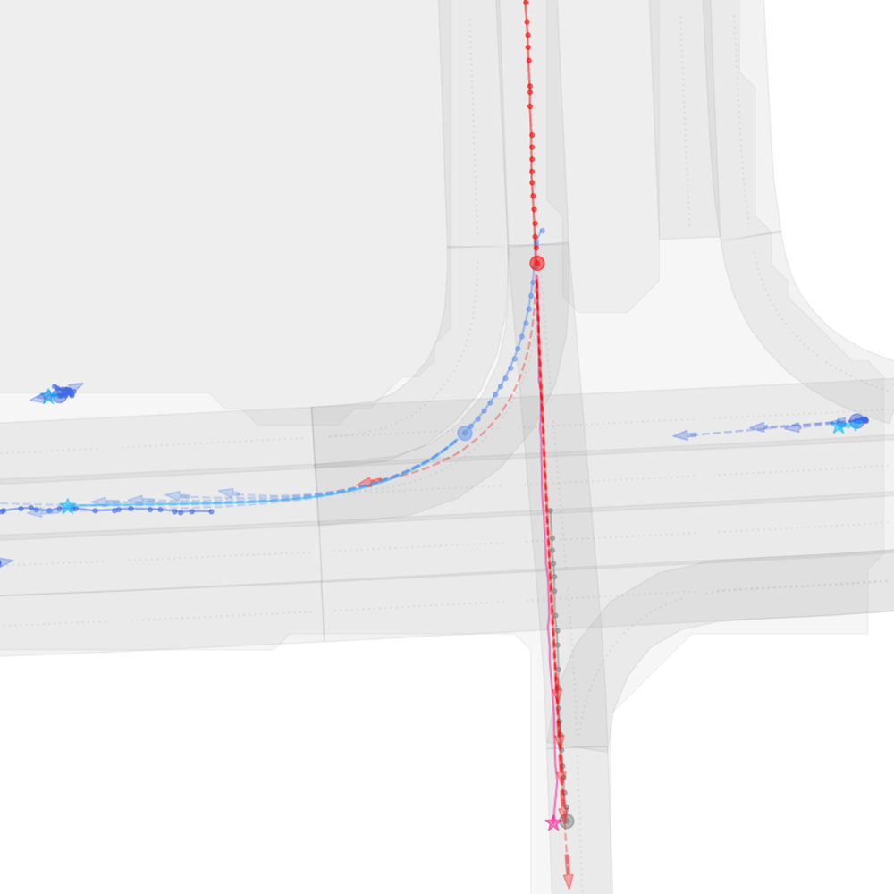
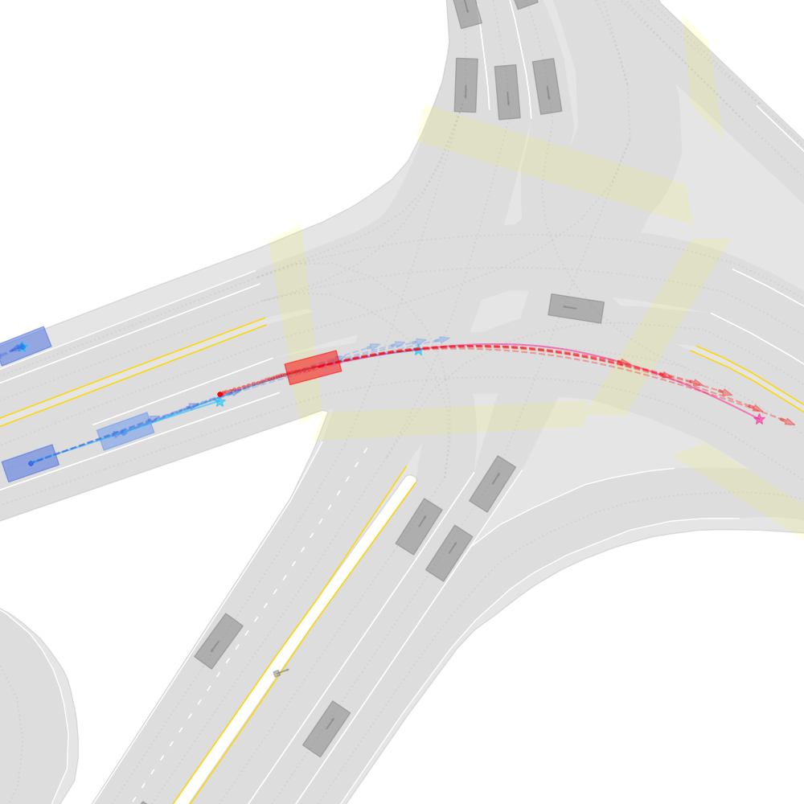
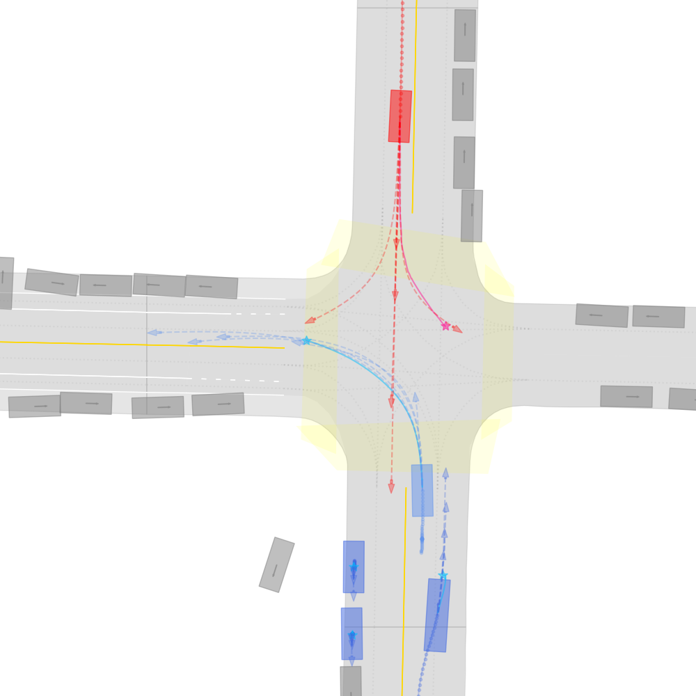
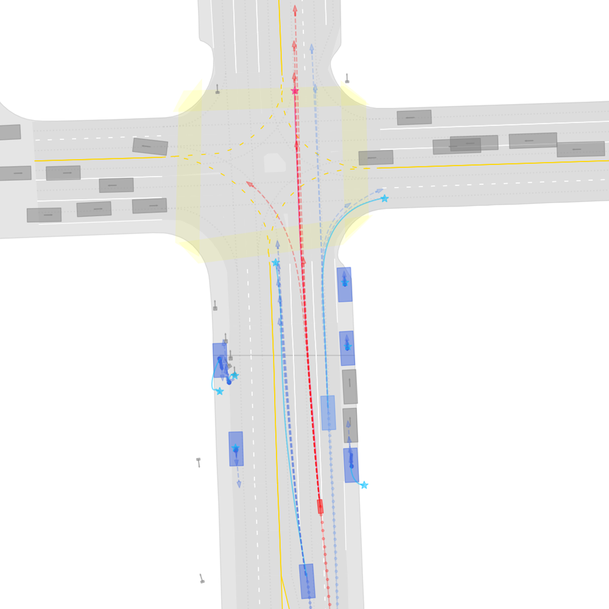

# SIMPL: A Simple and Efficient Multi-agent Motion Prediction Baseline for Autonomous Driving

<p align="center">
  
</p>

## Introduction
This is the project page of the paper

* Lu Zhang, Peiliang Li, Sikang Liu, and Shaojie Shen, "SIMPL: A Simple and Efficient Multi-agent Motion Prediction Baseline for Autonomous Driving", arXiv preprint arXiv:2402.02519 (2024), (Corresponding author: Lu ZHANG, lzhangbz@connect.ust.hk),

which is accepted for publication in the IEEE Robotics and Automation Letters (RA-L), 2024.

**Preprint:** [arXiv](https://arxiv.org/abs/2402.02519)

**Video:** [YouTube](https://youtu.be/_8-6ccopZMM)

## Qualitative Results

* On Argoverse 1 motion forecasting dataset
<p align="center">
  
  
  
  
</p>

* On Argoverse 2 motion forecasting dataset
<p align="center">
  
  
  
  
</p>

----

## Todo List
- [x] Release code for Argoverse 2 dataset
- [x] Release training and evaluation scripts for DDP
- [x] First release

## Gettting Started

### Install dependencies
- Create a new conda virtual env
```
conda create --name simpl python=3.8
conda activate simpl
```

- Install PyTorch according to your CUDA version. We recommend CUDA >= 11.1, PyTorch >= 1.8.0.
```
conda install pytorch==1.12.0 torchvision==0.13.0 torchaudio==0.12.0 cudatoolkit=11.6 -c pytorch -c conda-forge
```

- Install Argoverse 1 & 2 APIs, please follow [argoverse-api](https://github.com/argoai/argoverse-api) and [av2-api](https://argoverse.github.io/user-guide/getting_started.html).


- Install other dependencies
```
pip install scikit-image IPython tqdm ipdb tensorboard
```

### Play with pretrained models (Argoverse 1)
Generate a subset of the dataset for testing using the script. It will generate 1k samples to `data_argo/features/`:
```
sh scripts/argo_preproc_small.sh
```
The dataset directory should be organized as follows:
```
data_argo
├── features
│   ├── train
│   │   ├── 100001.pkl
│   │   ├── 100144.pkl
│   │   ├── 100189.pkl
...
│   └── val
│       ├── 10018.pkl
│       ├── 10080.pkl
│       ├── 10164.pkl
...
```

The pre-trained weights are located at `saved_models/`. Use the script below to visualize prediction results:
```
sh scripts/simpl_av1_vis.sh
```

Since we store each sequence as a single file, the system may raise error `OSError: [Erron 24] Too many open files` during evaluation and training. You may use the command below to solve this issue:
```
ulimit -SHn 51200
ulimit -s unlimited
```

To evaluate the trained models:
```
sh scripts/simpl_av1_eval.sh
```
You are supposed to get:
```
Validation set finish, cost 289.01 secs
-- minade_1: 1.428 minfde_1: 3.240 mr_1: 0.512 brier_fde_1: 3.240 minade_k: 0.658 minfde_k: 0.947 mr_k: 0.081 brier_fde_k: 1.558
```

### Train from scratch

- Preprocess full Argoverse 1 motion forecasting dataset using the script:
```
sh scripts/argo_preproc_all.sh
```
The preprocessed dataset will cost about 15 GB storage, please reserve enough space for preprocessing.

- Launch training using the script:
```
# single-GPU
sh scripts/simpl_av1_train.sh

# multi-GPU based on DDP
sh scripts/simpl_av1_train_ddp.sh
```

- For model evaluation, please refer to the following scripts:
```
# single-GPU
sh scripts/simpl_av1_eval.sh

# multi-GPU based on DDP
sh scripts/simpl_av1_eval_ddp.sh
```

### Train/Evaluate/Visualize SIMPL using Argoverse 2
Please refer to the scripts in the directory `scripts/`, and the usage is similar to scripts for the Argoverse 1 dataset. If you have any questions, please feel free to raise an issue or contact us via email.


## Acknowledgment
We would like to express sincere thanks to the authors of the following packages and tools:
- [LaneGCN](https://github.com/uber-research/LaneGCN)
- [HiVT](https://github.com/ZikangZhou/HiVT)
- [DSP](https://github.com/HKUST-Aerial-Robotics/DSP)

## License
This repository is licensed under [MIT license](https://github.com/HKUST-Aerial-Robotics/SIMPL/blob/main/LICENSE).